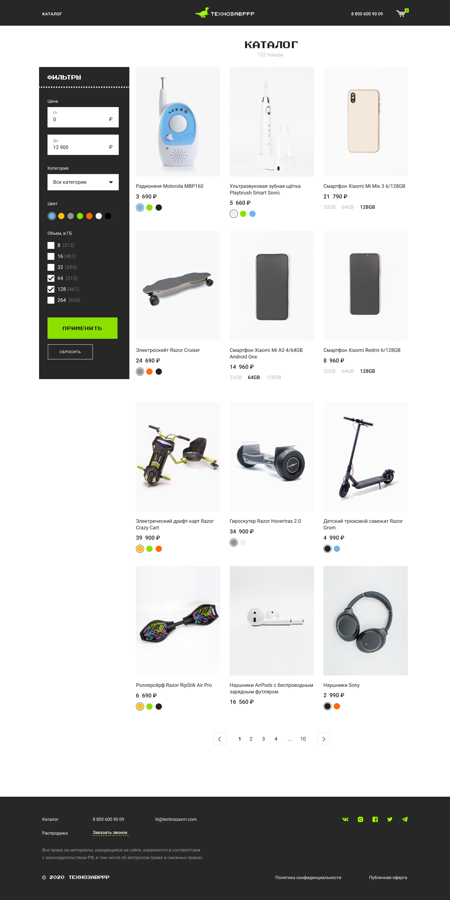

# Интернет-магазин "Технозавррр" на VueJS

- API для получения неполных [данных](https://vue-study.skillbox.ru/#/)
- API для получения полных [данных](https://vue-tzr.skillbox.cc/#/)

Посмотреть можно тут: <a href="https://vue-store-tekhnozavrrr.noble24.pro/">  </a> и <a href="https://store-tekhnozavrrr.netlify.app/">  </a>



## Project setup
```
npm install
```

### Compiles and hot-reloads for development
```
npm run serve
```

### Compiles and minifies for production
```
npm run build
```

### Lints and fixes files
```
npm run lint
```

### Customize configuration
See [Configuration Reference](https://cli.vuejs.org/config/).
